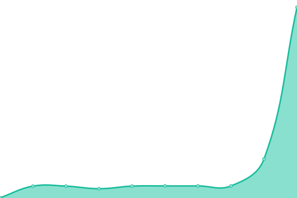
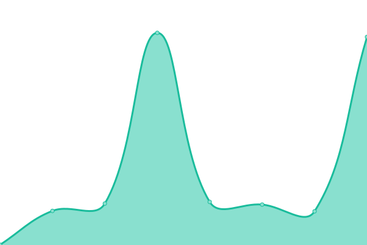
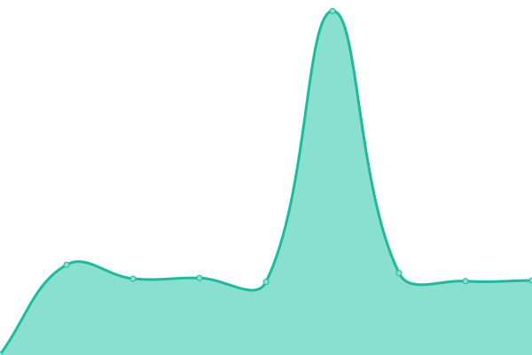

# [📈 Live Status](https://Limbo-Studios.github.io/limbo-status-page): <!--live status--> **🟧 Corte parcial**

This repository contains the open-source uptime monitor and status page for [Limbo-Studios](https://Limbo-Studios.github.io/limbo-status-page), powered by [Upptime](https://github.com/upptime/upptime).

With [Upptime](https://upptime.js.org), you can get your own unlimited and free uptime monitor and status page, powered entirely by a GitHub repository. We use [Issues](https://github.com/Limbo-Studios/limbo-status-page/issues) as incident reports, [Actions](https://github.com/Limbo-Studios/limbo-status-page/actions) as uptime monitors, and [Pages](https://Limbo-Studios.github.io/limbo-status-page) for the status page.

<!--start: status pages-->
<!-- This summary is generated by Upptime (https://github.com/upptime/upptime) -->
<!-- Do not edit this manually, your changes will be overwritten -->
<!-- prettier-ignore -->
| URL | Estado | Historia | Tiempo de respuesta | tiempo de actividad |
| --- | ------ | ------- | ------------- | ------ |
|  [Limbo Yggdrasil Multiplayer Session Service](https://auth.lsmp.tech/api/yggdrasil/sessionserver) | 🟥 Caído | [limbo-yggdrasil-multiplayer-session-service.yml](https://github.com/Limbo-Studios/limbo-status-page/commits/HEAD/history/limbo-yggdrasil-multiplayer-session-service.yml) | 

 592ms
     
 | 

<a href="https://status.lsmp.tech/history/limbo-yggdrasil-multiplayer-session-service">0.00%</a>
    

|  [Limbo Yggdrasil Authserver](https://auth.lsmp.tech/api/yggdrasil) | 🟥 Caído | [limbo-yggdrasil-authserver.yml](https://github.com/Limbo-Studios/limbo-status-page/commits/HEAD/history/limbo-yggdrasil-authserver.yml) | 

 433ms
     
 | 

<a href="https://status.lsmp.tech/history/limbo-yggdrasil-authserver">0.00%</a>
    

|  [Mojang Multiplayer Session Service](http://session.minecraft.net) | 🟩 Arriba | [mojang-multiplayer-session-service.yml](https://github.com/Limbo-Studios/limbo-status-page/commits/HEAD/history/mojang-multiplayer-session-service.yml) | 

 119ms
     
 | 

<a href="https://status.lsmp.tech/history/mojang-multiplayer-session-service">100.00%</a>
    

|  [Skins](https://auth.lsmp.tech/texture) | 🟥 Caído | [skins.yml](https://github.com/Limbo-Studios/limbo-status-page/commits/HEAD/history/skins.yml) | 

 47ms
     
 | 

<a href="https://status.lsmp.tech/history/skins">0.00%</a>
    

|  [Limbo Yggdrasil Public API](https://auth.lsmp.tech/api/yggdrasil) | 🟥 Caído | [limbo-yggdrasil-public-api.yml](https://github.com/Limbo-Studios/limbo-status-page/commits/HEAD/history/limbo-yggdrasil-public-api.yml) | 

 47ms
     
 | 

<a href="https://status.lsmp.tech/history/limbo-yggdrasil-public-api">0.00%</a>
    

|  [Main LimboAuth Website](https://auth.lsmp.tech/) | 🟥 Caído | [main-limbo-auth-website.yml](https://github.com/Limbo-Studios/limbo-status-page/commits/HEAD/history/main-limbo-auth-website.yml) | 

 47ms
     
 | 

<a href="https://status.lsmp.tech/history/main-limbo-auth-website">0.00%</a>
    

|  [Limbo Yggdrasil](https://auth.lsmp.tech/api/yggdrasil/sessionserver/session/minecraft/profile) | 🟥 Caído | [limbo-yggdrasil.yml](https://github.com/Limbo-Studios/limbo-status-page/commits/HEAD/history/limbo-yggdrasil.yml) | 

 47ms
     
 | 

<a href="https://status.lsmp.tech/history/limbo-yggdrasil">0.00%</a>
    

<!--end: status pages-->

[**Visit our status website →**](https://Limbo-Studios.github.io/limbo-status-page)

## 📄 License

- Powered by: [Upptime](https://github.com/upptime/upptime)
- Code: [MIT](./LICENSE) © [Anand Chowdhary](https://anandchowdhary.com), supported by [Pabio](https://pabio.com)
- Data in the `./history` directory: [Open Database License](https://opendatacommons.org/licenses/odbl/1-0/)
